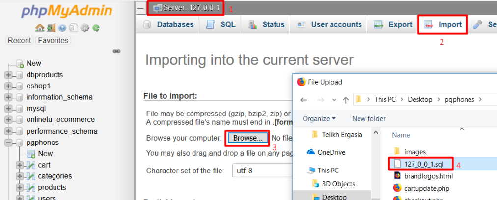

     
  An e-commerce website for smartphones. Built with pure <i>PHP</i> and <i>CSS</i>.

  

## Technologies
* **PHP**
* **CSS**
* **JavaScript**
* **MySQL**
 

## Installation
This application is suggested to be installed with the help of **XAMPP** (https://www.apachefriends.org/index.html).

1. First, the database for the application must be created. Through _phpMyAdmin_ we navigate to _import_ and we choose the file _127.0.0.1.sql_ .

  

2. Now we must place the application files in the Apache server. The path is usually _C:\xampp\htdocs_ and inside _htdocs_ we place the folder _pgphones_.

3. After we initiate the service of _Apache_ and _MySQL_ from xampp the application is ready to use. It runs on the address _localhost:port/pgphones_ ,where port is the endpoint in which our Apache server runs.

## Visuals
 

## Features
 

## Notes
University project for the course of _E-commerce_.
